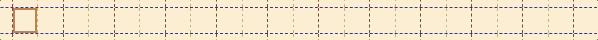

# Spellcaster

[Click here to see it live!](https://v1.simondebevoise.com/Spellcaster)


Cast spells with words! In Spellcaster, a user can chain sequences of keywords that effects the properties of a 'spell'. These spells move about and effect a grid of cells that contain either a character or nothing at all. For example, the spell 'upfooupleftredbar' contains the keywords 'up', 'up', 'left', 'red', which determines that the spell will have a red background and will move up 2 spaces and left 1 space per animation frame. By pressing space, a user releases that spell and can start a new one. Spells take effect even as a user is creating one, so the cursor will move with the spell. After a few spells, the grid should be full of fun, zany spells!

#### Example keywords: 

* up, down, left, right - determines direction
* all, clear - effects preexisting spells
* mono, sans, serif - sets font type
* big, small - increases / decreases font size
* blue, red, green, yellow - changes background color
* emoji - converts text to emoji keyboard
* spell - creates random spell
* explode - letters of spell each go off in random direction
* type, test - a 60-second typing speed race that counts words per minute
* snake - player-controlled snake ‘eats’ and appends colorful, styled HTML elements to its body.


## What the heck is going on?

#### Dropdown menus with information on how to play


#### Test your typing speed with TypeTest


Type test randomly generates text from a list of the 1000 most commonly used english words. After a minute of typing, the sub-feature calculates the number of correct words typed per minute. 

```js
    ensureUserWords() {
        if (this.userWords.length < 50 + this.currentWord) {
            for (let i = 0; i <= 50; i++) {
                let randIdx = Math.floor(Math.random() * this.topWords.length);
                let randWord = this.topWords[randIdx];
                let word = {
                    word: randWord,
                    mistyped: false
                }
                
                this.userWords.push(word);
            } 
        }
    }
```

## Technologies

Plain ol' JavaScript, HTML, and CSS! The only external libraries on which Spellcaster depends are Webpack and Babel. I had become really comfortable with React, jQuery, Sass and wanted to challenge myself to create a website using just vanilla JS and DOM manipulation.

#### Game structure

* `index.js` - queries for `#root` element and passes it to `Grid`
* `grid.js`
    * handles rendering
    * populates window with grid of container elements, stores these elements in easily accessible 2d-array
    * contains instances of all active spells    
* `spell.js` 
    * handles parsing text, dispatching action if scope is beyond the individual spell
    * contains properties that correspond to spell actions
    
    

    
